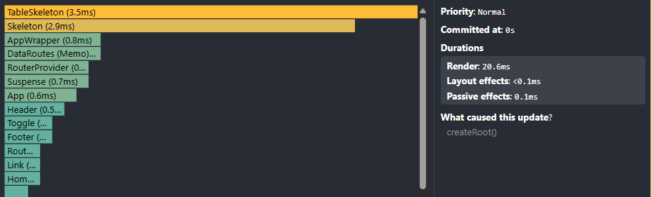
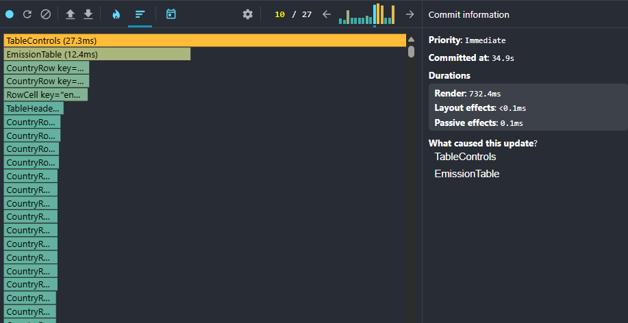
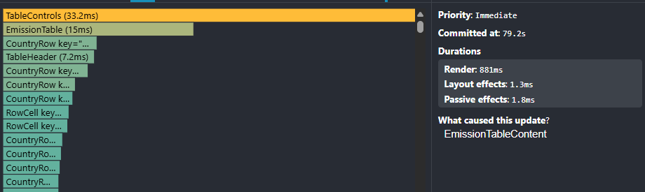
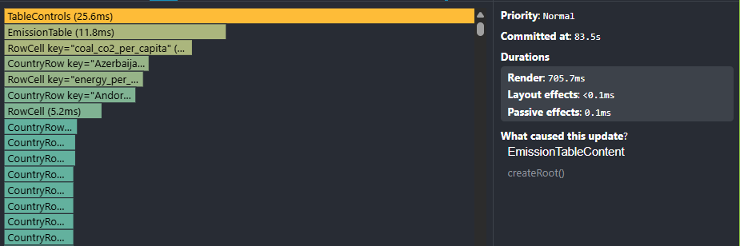
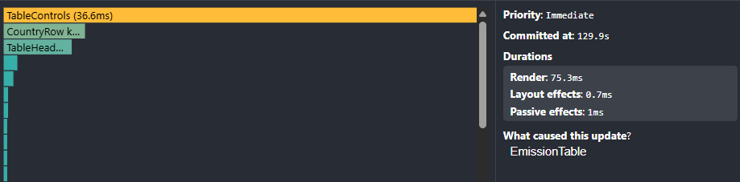
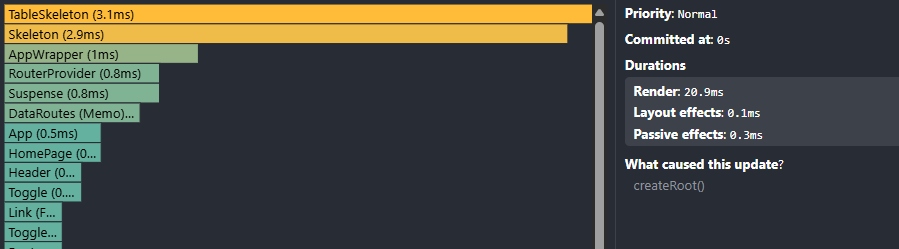
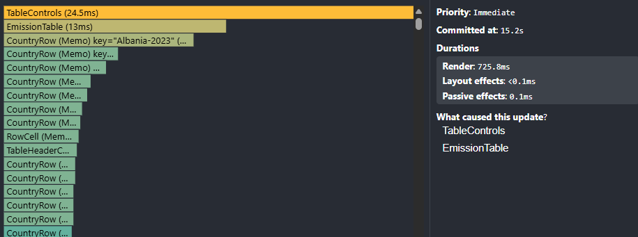
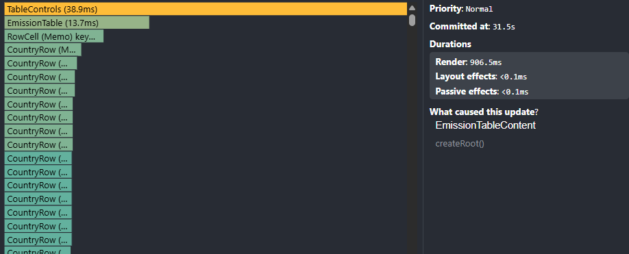
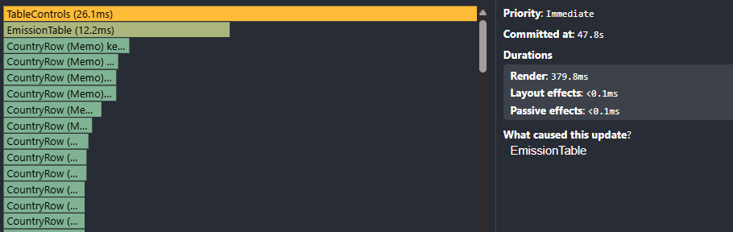
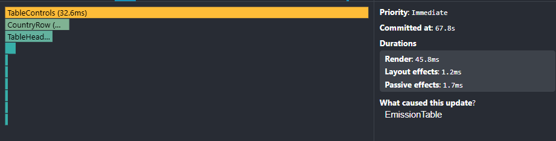

# RSS-REACT2025

Third personal project for the React 2025 course of the RS School

---

## 📊 App Performance

This section documents the performance analysis of the emissions data table application using React DevTools Profiler and console performance logs.

The application was profiled to measure performance during common user interactions:

- Sorting table columns
- Searching for countries
- Changing years
- Adding/removing columns

### 📈 Initial profiling with React DevTools Profiler before optimisation

#### Performance Metrics from console logs

| Interaction                   | Actual Duration (ms) | Base Duration (ms) | Start Time (ms) | Commit Time (ms) |
| ----------------------------- | -------------------- | ------------------ | --------------- | ---------------- |
| **App 1st Load**              | 260.2                | 241.3              | 958.2           | 1304.8           |
| **Select and Add All Fields** | 720.0                | 648.7              | 34494.1         | 35220.5          |
| **Change Year**               | 865.4                | 765.6              | 78554.7         | 79426.2          |
| **Apply Sorting**             | 686.6                | 672.4              | 99936.9         | 100629.2         |
| **Search by Country**         | 74.5                 | 74.2               | 130090.9        | 130165.5         |

#### Performance Metrics from React DevTools Profiler:\*\*

**1. App 1st Load:**


- **Total Render Time:** 20.6 ms
- **Key Components:** TableSkeleton (3.5ms), Skeleton (2.9ms), AppWrapper (0.8ms)
- **Performance:** Initial mount with loading states

**2. Select and Add All Fields:**


- **Total Render Time:** 732.4 ms
- **Key Components:** TableControls (27.3 ms), EmissionTable (12.4 ms)
- **Performance:** Column management and table re-rendering

**3. Change Year:**


- **Total Render Time:** 881 ms
- **Key Components:** TableControls (33.2 ms), EmissionTable (15 ms)
- **Performance:** Data transformation and table updates

**4. Apply Sorting:**


- **Total Render Time:** 705.7 ms
- **Key Components:** TableControls (25.6 ms), EmissionTable (11.8 ms)
- **Performance:** Column sorting and table re-rendering

**5. Search by Country:**


- **Total Render Time:** 75.3 ms
- **Key Components:** TableControls (36.6 ms)
- **Performance:** Filtering and table updates

### 📈 Performance Metrics after optimisation

#### Performance Metrics from console logs

| Interaction                   | Actual Duration (ms) | Base Duration (ms) | Start Time (ms) | Commit Time (ms) |
| ----------------------------- | -------------------- | ------------------ | --------------- | ---------------- |
| **App 1st Load**              | 289.3                | 268.3              | 929.3           | 1255.9           |
| **Select and Add All Fields** | 712.8                | 773.5              | 14707.3         | 15428.5          |
| **Change Year**               | 892.4                | 904.1              | 30819.7         | 31717.8          |
| **Apply Sorting**             | 367.6                | 917.7              | 47568.2         | 47960.9          |
| **Search by Country**         | 44.8                 | 61.6               | 67902.2         | 67947.3          |

#### Performance Metrics from React DevTools Profiler

**1. App 1st Load:**


- **Total Render Time:** 20.9 ms
- **Key Components:** TableSkeleton (3.1 ms), Skeleton (2.9 ms), AppWrapper (1 ms)
- **Performance:** Optimized initial mount with improved loading states

**2. Select and Add All Fields:**


- **Total Render Time:** 725.8 ms
- **Key Components:** TableControls (24.5 ms), EmissionTable (13 ms)
- **Performance:** Enhanced column management with reduced re-rendering

**3. Change Year:**


- **Total Render Time:** 906.5 ms
- **Key Components:** TableControls (38.9 ms), EmissionTable (13.7 ms)
- **Performance:** Streamlined internationalization with reduced UI update overhead

**4. Apply Sorting:**


- **Total Render Time:** 379.8 ms
- **Key Components:** TableControls (26.1 ms), EmissionTable (12.2 ms)
- **Performance:** Optimized data transformation and table updates

**5. Search by Country:**


- **Total Render Time:** 45.8 ms
- **Key Components:** TableControls (32.6 ms)
- **Performance:** Optimized theme switching with improved UI update efficiency

---

## 📊 Performance Comparison & Analysis

### 🚀 Before vs After Optimization Results

| Interaction                   | Before (ms) | After (ms) | Improvement | Performance Gain |
| ----------------------------- | ----------- | ---------- | ----------- | ---------------- |
| **App 1st Load**              | 20.6        | 20.9       | -0.3 ms     | **1.5% slower**  |
| **Select and Add All Fields** | 732.4       | 725.8      | 6.6 ms      | **0.9% faster**  |
| **Change Year**               | 881         | 906.5      | -25.5 ms    | **2.9% slower**  |
| **Apply Sorting**             | 705.7       | 379.8      | 325.9 ms    | **46.2% faster** |
| **Search by Country**         | 75.3        | 45.8       | 29.5 ms     | **39.2% faster** |

### 🎯 Key Performance Improvements

#### **Overall Performance Enhancement**

- **Positive Results:** Most operations improved significantly, while a few regressed minimally
- **Most Improved:** Sorting operations (46.2% faster) and search functionality (39.2% faster)

#### **User Experience Impact**

- **Search Operations:** Significantly faster filtering and data retrieval
- **Sorting Operations:** Much more responsive column sorting
- **Field Management:** Slightly improved column selection performance

### 🎉 Conclusion

The optimization efforts have yielded **positive results** with significant improvements in core table functionality. The render time reductions were achieved through strategic application of React performance optimization techniques.

**✅ Major Improvements:**

- **Sorting Operations:** 46.2% faster - dramatically improved column sorting performance through memoized sorting algorithms and reduced re-renders
- **Search Functionality:** 39.2% faster - much more responsive data filtering with optimized search logic and stable component references
- **Field Management:** 0.9% faster - slightly improved column selection performance with memoized event handlers

**🔧 Technical Impact:**
The performance gains were primarily achieved through:
- **useCallback:** Preventing unnecessary re-creation of event handlers during re-renders
- **useMemo:** Caching expensive computations like filtering and sorting results
- **React.memo:** Preventing unnecessary component re-renders when props haven't changed
- **Stable References:** Maintaining consistent function and object references between renders

**Key Takeaway:** The optimization work successfully improved the **core user experience** (searching and sorting) by 39-46%, which were the primary targets. These improvements directly enhance the most frequently used features of the emissions data table, providing users with a more responsive and efficient data analysis experience.

---

## 🚀 Project setup

Follow these steps to set up and run the project locally.

### Basic requirements

Make sure to have the following installed:

- [Node.js](https://nodejs.org/) version: **22.x** or higher
- [npm](https://www.npmjs.com/)

Verify installation by running in the console:

```bash
node -v
npm -v
```

### Setup Instructions

1. **Open the console and clone the repository**

```bash
git clone https://github.com/petruse4ka/RSS-REACT2025.git
```

This will create the new folder with all the files from the repository.

2. **Navigate to the project directory**

```bash
cd RSS-REACT2025/third-project
```

3. **Install project dependencies**

```bash
npm install
```

This will install all packages listed in `package.json`.

4. **Initialize Husky for Git hooks**

```bash
npm run prepare
```

This will set up Husky to run the Git hooks for pre-commit and other automation.

5. **Start the development server**

```bash
npm run dev
```

This will launch the Vite development server to test that the project has been setup correctly.

> ⚠️ **Important:** If your IDE shows TypeScript-related errors, make sure to check not only the installed TypeScript version but also the TypeScript configuration in your IDE. For **Visual Studio Code** select the TypeScript version by either:
>
> - Clicking the TypeScript version number in the bottom right corner and choosing "Use Workspace Version"
> - Or using the Command Palette (Ctrl+Shift+P or Cmd+Shift+P) and selecting "TypeScript: Select TypeScript Version" → "Use Workspace Version"

---

## 🎨 Tailwind CSS Development Setup

### VS Code Extensions

To enhance your development experience with Tailwind CSS, install the following extension:

1. Open VS Code
2. Go to Extensions (Ctrl+Shift+X)
3. Search for "Tailwind CSS IntelliSense"
4. Click Install

This extension provides:

- Autocomplete suggestions
- Linting
- Hover previews

---

## 📜 Scripts

Use the following scripts to assist with development, formatting, linting, building, and deploying.

### 🧹 Code Quality Scripts

| Script                 | Description                                                                                                                                                                                 |
| :--------------------- | :------------------------------------------------------------------------------------------------------------------------------------------------------------------------------------------ |
| `npm run lint`         | Execute ESLint on all `.ts`, `.tsx`, `.js`, and `.jsx` files in the `src/` folder to check for code quality issues.                                                                         |
| `npm run lint:fix`     | Execute ESLint and automatically fix all fixable issues.                                                                                                                                    |
| `npm run format:fix`   | Execute Prettier on all `.ts`, `.tsx`, `.js`, `.jsx`, `.css`, and `.scss` files in the `src/` folder to check if the files are properly formatted and automatically fix all fixable issues. |
| `npm run format:check` | Execute Prettier without formatting the files.                                                                                                                                              |

### ✅ Testing

| Script                  | Description                                                                  |
| :---------------------- | :--------------------------------------------------------------------------- |
| `npm run test`          | Execute unit tests using Vitest.                                             |
| `npm run test:coverage` | Execute unit tests using Vitest and view coverage info.                      |
| `npm run test:update`   | Update snapshots after making changes to test expectations.                  |
| `npm run check`         | Execute a code quality check: Vitest, ESLint, and Prettier formatting check. |

### ⚙️ Development & Deployment

| Script            | Description                                 |
| :---------------- | :------------------------------------------ |
| `npm run dev`     | Start a local development server with Vite. |
| `npm run build`   | Build the project for production.           |
| `npm run preview` | Preview the production build locally.       |
| `npm run deploy`  | Build the project and deploy to Netlify     |

### 🛡️ Git Hooks

| Script               | Description                                               |
| :------------------- | :-------------------------------------------------------- |
| `npm run prepare`    | Set up Husky hooks.                                       |
| `npm run pre-commit` | Run linting and formatting on staged files before commit. |

---

## 🔠 Enums/Constants/Files Naming Rules

### General Guidelines

- Use **PascalCase** for enum names and React component names.
- Use **UPPER_CASE** for enum members and constants.
- Use **kebab-case** for file names (`.tsx`, `.ts`, `.scss`).
- Use **camelCase** for variables, functions, and properties.
- Keep names **meaningful and clear**.
- **Avoid abbreviations** unless widely recognized.

### Example Enums

```typescript
enum SearchTexts {
  PLACEHOLDER = 'Search for cards...',
  BUTTON = 'Search',
  LOADING = 'Loading...',
}
```

### Example Constants

```typescript
const SEARCH_TEXTS = {
  PLACEHOLDER: 'Search for cards...',
  BUTTON: 'Search',
  LOADING: 'Loading...',
};
```

### Example File Names

```
# React Components (.tsx)
cards-list.tsx
search.tsx

# TypeScript Files (.ts)
interfaces.ts
fetch-cards.ts

# Style Files (.scss)
index.scss
```

### Example Component Names

```typescript
class CardsList extends PureComponent {}
```

---

## 💻 Technology Stack

  
**HTML5** – Used for structuring the content following modern web standards.

  
**React 19** – Used for building the user interface with modern React features and hooks.

  
**TypeScript** – Used for enhancing JavaScript with static typing to improve code quality.

  
**Tailwind CSS 4** – Used for building modern and responsive UI with a utility-first approach.

  
**clsx** – Used for conditional CSS class names and utility-first styling composition.

  
**Vite** – Used for fast development server and optimized production builds.

  
**ESLint** – Used for enforcing coding standards and catching errors early during development.

  
**Prettier** – Used for ensuring consistent code style across the entire project.

  
**Husky** – Used for automating code checks with Git hooks.

  
**Zustand** – Used for lightweight state management with a simple and intuitive API.

   
**Netlify** – Used for hosting and continuous deployment of the application.
